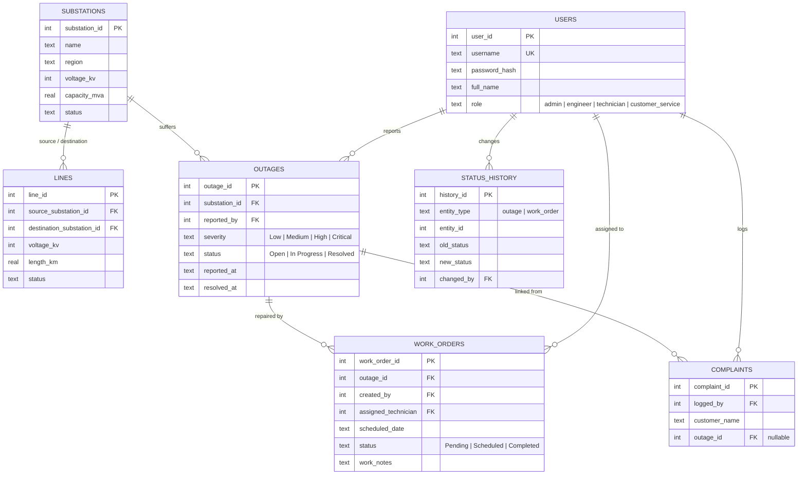
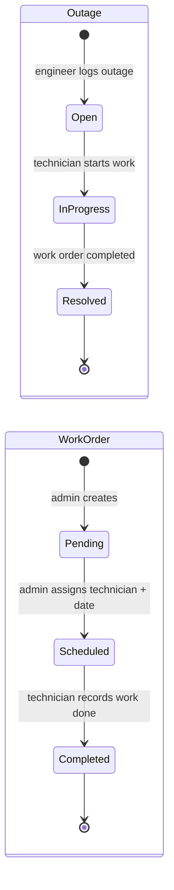
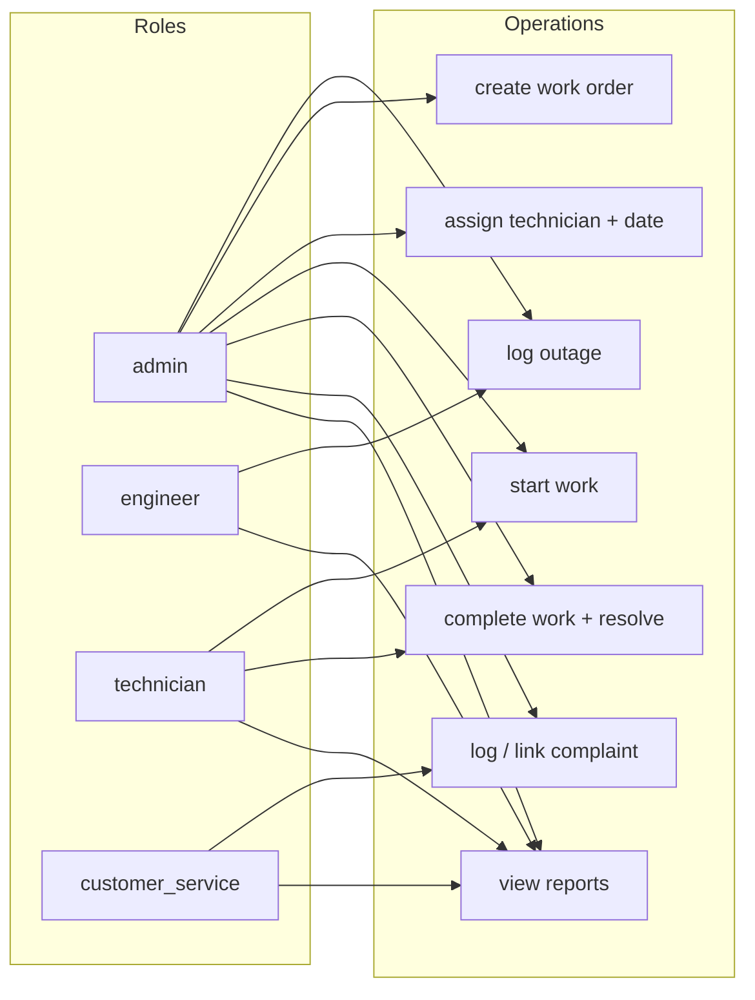
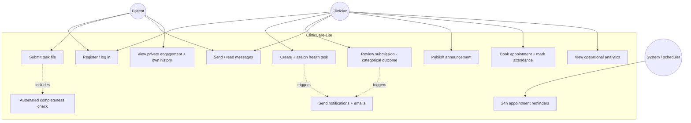
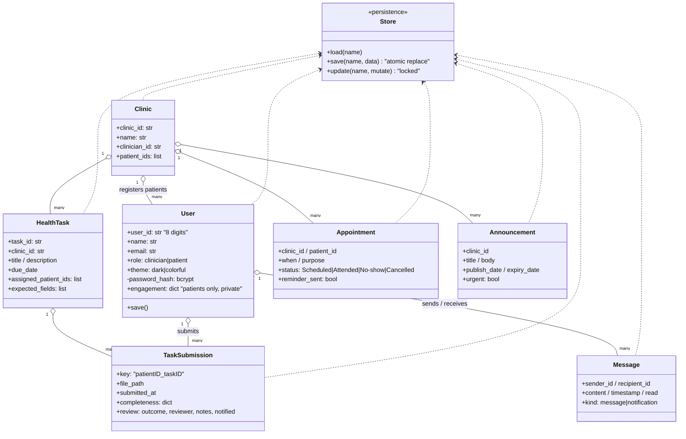
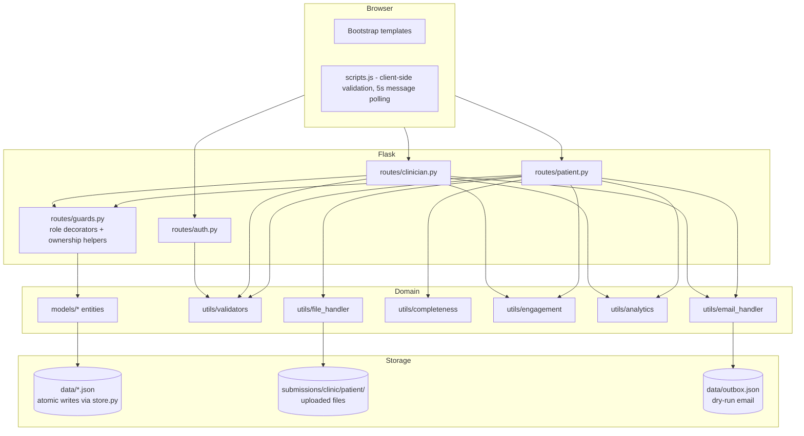
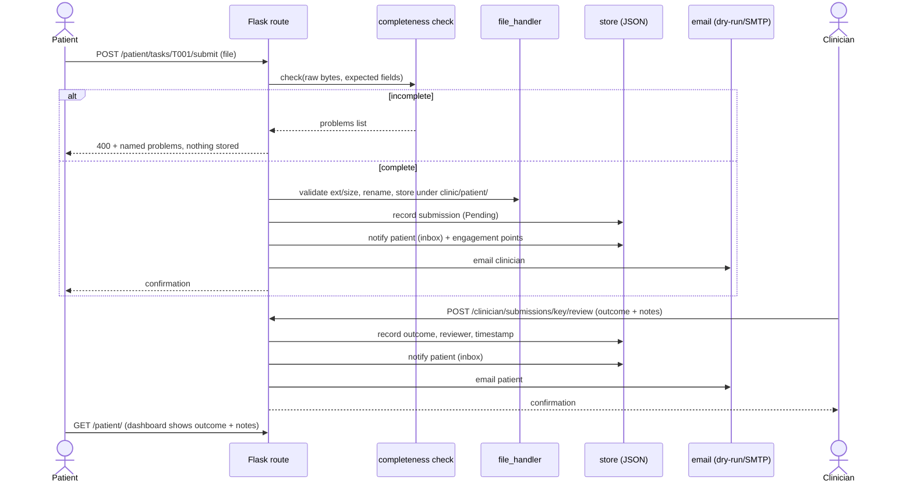
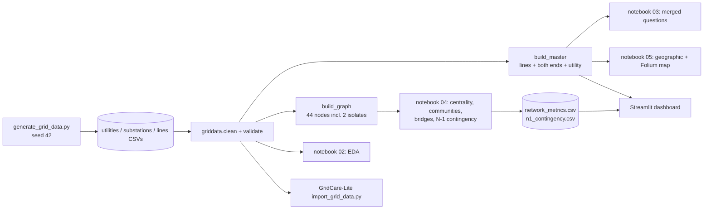

# Design Diagrams

All diagrams are Mermaid, so GitHub renders them inline. Sources are the diagrams —
edit here, not in an image editor.

## 1. GridCare-Lite

### 1.1 Entity-relationship diagram

### 1.2 Outage / work-order state machines

Completing a work order resolves its outage in the same operation, so the two
records can never disagree. Both machines are enforced in `services.py` on every
transition; `status_history` records each change with who and when.

### 1.3 Role → permitted operations

Every operation re-checks the caller's role inside `services.py` — hiding a button
is presentation, the service check is the control. Technicians additionally may only
act on work orders assigned to them.

## 2. ClinicCare-Lite

### 2.1 Use-case diagram

### 2.2 Class diagram (entities and their managers)

### 2.3 System architecture

### 2.4 Data-flow: submission → review → notification

## 3. Grid analysis pipeline

